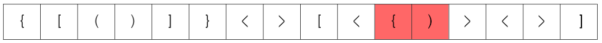
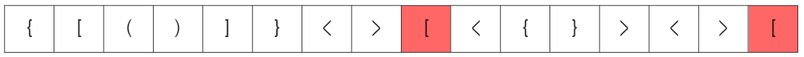
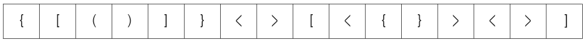

### [S/W 문제해결 기본] 4일차 - 괄호 짝짓기

4 종류의 괄호문자들 '()', '[]', '{}', '<>' 로 이루어진 문자열이 주어진다.

이 문자열에 사용된 괄호들의 짝이 모두 맞는지 판별하는 프로그램을 작성한다.

예를 들어 아래와 같은 문자열은 유효하다고 판단할 수 있다.

</img>

아래와 같은 문자열은 유효하지 않은 문자열이다. 붉은색으로 표시된 괄호의 짝을 찾을 수 없기 때문이다.

</img>

아래 문자열은 열고 닫는 괄호의 개수는 유효하나 짝이 맞지 않는 괄호가 사용 되었기 때문에 유효하지 않다.

</img>

----

## 입력

각 테스트 케이스의 첫 번째 줄에는 테스트케이스의 길이가 주어지며, 바로 다음 줄에 테스트 케이스가 주어진다.

총 10개의 테스트케이스가 주어진다.

---

## 출력

#부호와 함께 테스트 케이스의 번호를 출력하고, 공백 문자 후 유효성 여부를 1 또는 0으로 표시한다 (1 - 유효함, 0 - 유효하지 않음).

---

1. 비교할 list 두개를 만든다(열린 괄호 list, 닫힌 괄호 list)
2. 빈 stack을 만든다
3. 출력할 유효성 여부 result 의 기본 값을 0으로 둔다
4. 반복문으로 stack에 비교해서 쌓을 괄호 string들을 하나씩 가져온다
5. 열린 괄호가 들어오면 무조건 stack에 쌓는다
6. 닫힌 괄호가 들어오면 stack에 짝이 되는 열린 괄호가 있는지 확인한다 
짝이 되는 열린 괄호가 있다면 열린 괄호를 빼준다 remove 
짝이 되는 열린 괄호가 없다면 반복문을 종료한다 
7. for문이 모두 돌아가고 나서 stack의 len이 0이라면 유효성 여부 result를 1로 바꿔준다
