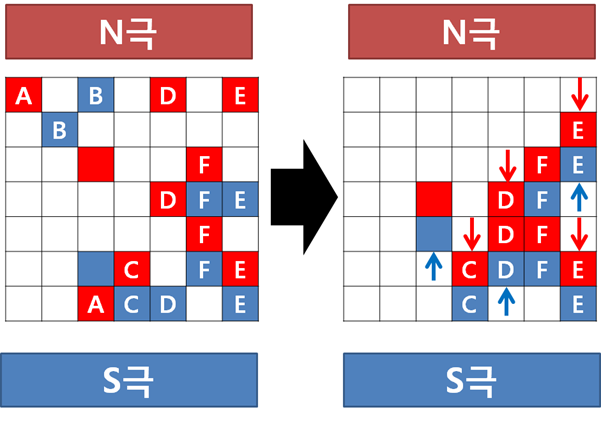

# [S/W 문제해결 기본] 5일차 - Magnetic

테이블 위에 자성체들이 놓여 있다.

자성체들은 성질에 따라 색이 부여되는데, 푸른 자성체의 경우 N극에 이끌리는 성질을 가지고 있고, 붉은 자성체의 경우 S극에 이끌리는 성질이 있다.

아래와 같은 테이블에서 일정 간격을 두고 강한 자기장을 걸었을 때, 시간이 흐른 뒤에 자성체들이 서로 충돌하여 테이블 위에 남아있는 교착 상태의 개수를 구하라.

아래는 자성체들이 놓여 있는 테이블을 위에서 바라본 모습이다.

A로 표시된 붉은 자성체의 경우 S극에 이끌리면서 테이블 아래로 떨어지게 된다.

B로 표시된 푸른 자성체의 경우 N극에 이끌리면서 테이블 아래로 떨어지게 된다.

나머지 자성체들은 서로 충돌하며, 교착 상태에 빠져 움직이지 않게 된다.

D로 표시된 자성체들에서 알 수 있듯 한 쪽 방향으로 움직이는 자성체의 개수가 많더라도 반대 방향으로 움직이는 자성체가 하나라도 있으면 교착 상태에 빠져 움직이지 않는다.

D로 표시된 자성체들과 같이 셋 이상의 자성체들이 서로 충돌하여 붙어 있을 경우에도 하나의 교착 상태로 본다.

C와 D는 좌우로 인접하여 있으나 각각 다른 교착 상태로 판단하여 2개의 교착 상태로 본다.

E의 경우와 같이 한 줄에 두 개 이상의 교착 상태가 발생할 수도 있다.

F의 경우 각각 다른 교착상태로 판단하여 2개의 교착상태로 본다.

위의 예시의 경우 테이블 위에 남아있는 교착상태는 7개이므로 7를 반환한다.

----
## 제약사항

자성체는 테이블 앞뒤 쪽에 있는 N극 또는 S극에만 반응하며 자성체끼리는 전혀 반응하지 않는다.

테이블의 크기는 100x100으로 주어진다. (예시에서는 설명을 위해 7x7로 주어졌음에 유의)

----

## 입력

각 테스트 케이스의 첫 번째 줄에는 정사각형 테이블의 한 변의 길이가 주어진다. 그리고 바로 다음 줄에 테스트 케이스가 주어진다.

총 10개의 테스트 케이스가 주어진다.

1은 N극 성질을 가지는 자성체를 2는 S극 성질을 가지는 자성체를 의미하며 테이블의 윗 부분에 N극이 아랫 부분에 S극이 위치한다고 가정한다.

---

## 출력

#부호와 함께 테스트 케이스의 번호를 출력하고, 공백 문자 후 교착 상태의 개수를 출력한다.

---

1. 비교할 list 두개를 만든다(열린 괄호 list, 닫힌 괄호 list)
2. 빈 stack을 만든다
3. 출력할 유효성 여부 result 의 기본 값을 0으로 둔다
4. 반복문으로 stack에 비교해서 쌓을 괄호 string들을 하나씩 가져온다
5. 열린 괄호가 들어오면 무조건 stack에 쌓는다
6. 닫힌 괄호가 들어오면 stack에 짝이 되는 열린 괄호가 있는지 확인한다 
짝이 되는 열린 괄호가 있다면 열린 괄호를 빼준다 remove 
짝이 되는 열린 괄호가 없다면 반복문을 종료한다 
7. for문이 모두 돌아가고 나서 stack의 len이 0이라면 유효성 여부 result를 1로 바꿔준다
