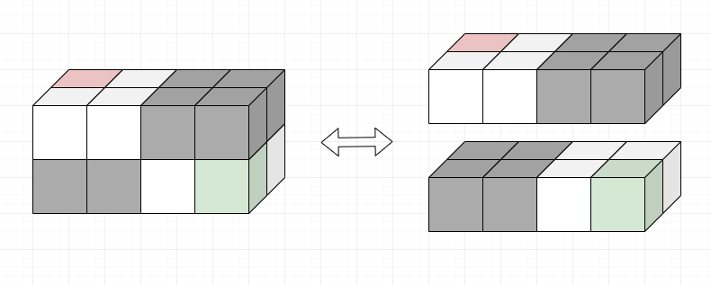

# 01

###### 문제 설명

하나 또는 그 이상의 층으로 구성된 3차원 공간이 있습니다. 이 공간은 빈 칸과 막힌 칸으로 구성되어 있습니다. 당신은 이 공간 상에서 위, 아래, 앞, 뒤, 좌, 우 6방향으로 이동할 수 있습니다. 하지만, 막힌 칸으로는 갈 수 없습니다. 당신은 이 공간의 두 지점 사이를 가능한 한 제일 빠르게 왕래하려고 합니다.

3차원 지도 데이터 map3d가 매개변수로 주어집니다. 주어진 지도에서 시작 지점부터 끝 지점까지 가는 최단거리를 찾아 return 하도록 solution 함수를 완성해주세요. 만약 시작 지점에서 끝 지점으로 가는 것이 불가능하다면, -1을 대신 return 해주세요.

##### 제한사항

- map3d는 2차원 문자열 배열입니다.
- map3d의 행의 개수는 1 이상 70 이하입니다.
- map3d의 각 행은 하나의 층을 의미합니다.
- map3d의 각 행의 길이는 1 이상 70 이하이며, 모두 동일합니다.
- map3d의 모든 문자열의 길이는 1 이상 70 이하이며, 모두 동일합니다.
- map3d의 모든 문자열은 `O`, `X`, `S`, `E`로 이루어져 있습니다.
- `O`는 이동이 가능한 빈 칸을 의미합니다.
- `X`는 이동이 불가능한 막힌 칸을 의미합니다.
- `S`는 시작 지점을 의미하며, map3d 상에서 딱 1번만 등장합니다.
- `E`는 끝 지점을 의미하며, map3d 상에서 딱 1번만 등장합니다.

------

##### 입출력 예

| map3d                                         | result |
| --------------------------------------------- | ------ |
| `[["XXXXX", "OOSXO", "OOXOO"], ["XEOOO", "OXXXO", "OOOOX"]]` | 13     |
| `[["OOOOO", "OOOOO", "OOEOO", "OOOOO", "OOOOO"], ["OOOOO", "OXXXO", "OXXXO", "OXXXO", "OOOOO"], ["OOOOO", "OOOOO", "OOSOO", "OOOOO", "OOOOO"]]`                                | 6      |
| `[["SOXX", "OOXX"], ["XXOO", "XXOE"]]`                                | -1     |

##### 입출력 예 설명

입출력 예 #1

- 주어진 미로와 최단 경로를 그림으로 표현하면 다음과 같습니다.
- 
- 흰색 큐브는 빈 칸, 회색 큐브는 막힌 칸, 적색 큐브는 시작지점, 녹색 큐브는 끝 지점을 의미합니다.
- 시작 지점부터 끝 지점까지 최단거리는 13입니다.

입출력 예 #2

- 주어진 미로와 최단 경로를 표현하면 다음과 같습니다.
- 
- 흰색 큐브는 빈 칸, 회색 큐브는 막힌 칸, 적색 큐브는 시작지점, 녹색 큐브는 끝 지점을 의미합니다.
- 시작 지점부터 끝 지점까지 최단거리는 6입니다. 그림에 표시된 방법 말고도 다른 최단 경로를 통해 이동할 수도 있습니다.

입출력 예 #3

- 주어진 미로와 최단 경로를 표현하면 다음과 같습니다.
- 
- 흰색 큐브는 빈 칸, 회색 큐브는 막힌 칸, 적색 큐브는 시작지점, 녹색 큐브는 끝 지점을 의미합니다.
- 시작 지점부터 끝 지점까지 이동하는 것이 불가능하므로, -1을 return 해야 합니다.

